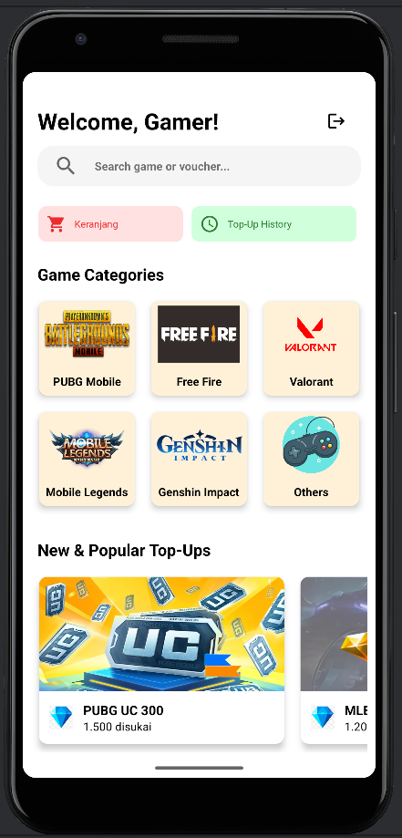
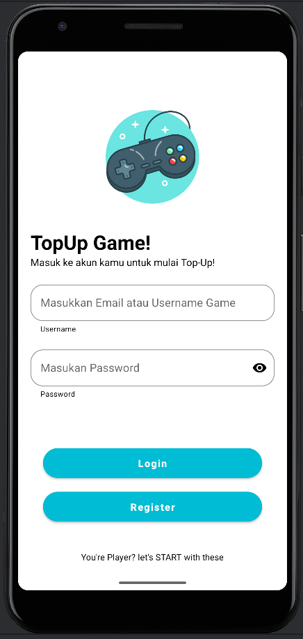
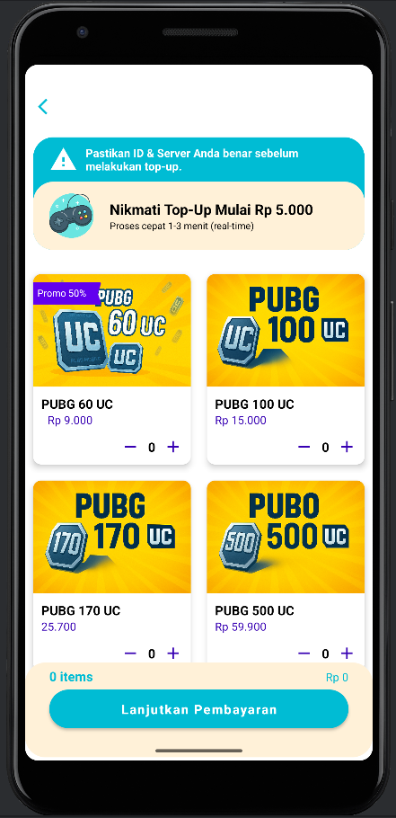
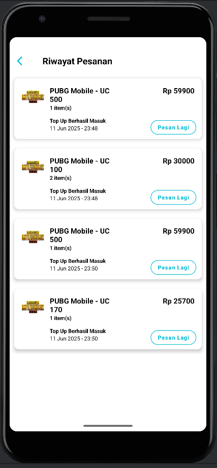

<h1 align="center">🎮 TopUpGameApp</h1>
<p align="center">
  Aplikasi Android Top-Up Game Sederhana dengan RecyclerView, Firebase Authentication & Firestore.
</p>

<p align="center">
  
</p>

---

## 📱 description

Project Aplikasi Android **TopUpGameApp** dibuat untuk memenuhi tugas akhir mata kuliah Pemrograman Berbasis Mobile 2. 
Aplikasi ini memungkinkan pengguna untuk:
- Melakukan **login & register**.
- Memilih **paket top-up** dari berbagai game populer.
- Menyimpan data transaksi ke **Firestore** setiap user.
- Melihat **riwayat pemesanan** yang dapat dihapus per item.
- Tampilan modern menggunakan **Material Design**.

---

## ✨ Features

| Fitur                         | Deskripsi                                                              |
|------------------------------|-----------------------------------------------------------------------|
| 🔐 Firebase Authentication    | Login & Register dengan validasi email dan password.                  |
| 📦 Order Top-Up               | Pilih paket top-up dari berbagai game.                            |
| 🧾 History Transaksi          | Riwayat pembelian tersimpan per user dan bisa dihapus.                |
| 🗃️ Firestore Integration      | Semua data disimpan di Firebase Firestore per UID.                    |
| 🧑 UI/UX Modern               | Tampilan bersih & konsisten dengan Material Components.               |

---

## 🛠️ Tech

- `Kotlin`
- `Android Studio`
- `Firebase Authentication`
- `Cloud Firestore`
- `Material Components`
- `ViewBinding`
- `RecyclerView`

---

## 🧪 Demo Apps

| Login/Register               | Order Game                   | Riwayat Pesanan                  |
|------------------------------|------------------------------|----------------------------------|
|  |  |  |

---

## 📦 How to Install

1. **Clone Repository**
   ```bash
   git clone https://github.com/JakwanAja/TopUpGame_App.git
   ```   
2. **Open Project**
   - Open Android Studio → Open Project → arahkan ke folder ini
3. **Sync Gradle**
   - Tunggu proses syncing selesai
   - Pastikan semua dependensi berhasil terunduh

---

## 🤝 TEAM

| Name                                    | GitHub Profile                                  |
|-----------------------------------------|-------------------------------------------------|
| **Muhamad Dzakwan Alfaris (234311019)** | [🌐 Profile](https://github.com/JakwanAja)      |
| **Alfonsus William H.S (234311005)**    | [🌐 Profile](https://github.com/willidevv)      |
| **Nabila Carrissa Dewi (234311021)**    | [🌐 Profile](https://github.com/nabilacarrissa) |
| **Nur Azizah Pagorante (234311022)**    | [🌐 Profile](https://github.com/aaazizah08)     |
| **Irma Reyta Julia Rahma (234311016)**  | [🌐 Profile](https://github.com/IrmReytaJ)      |


